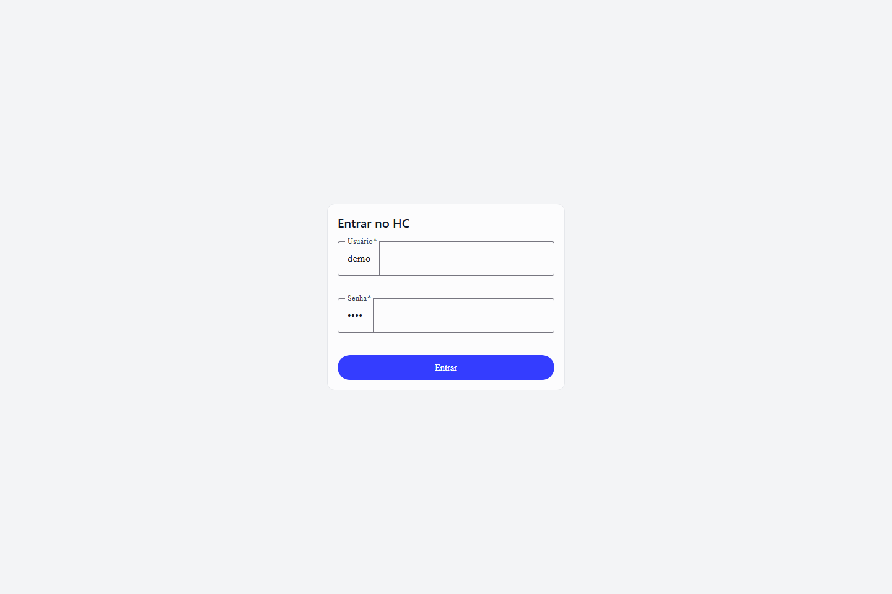
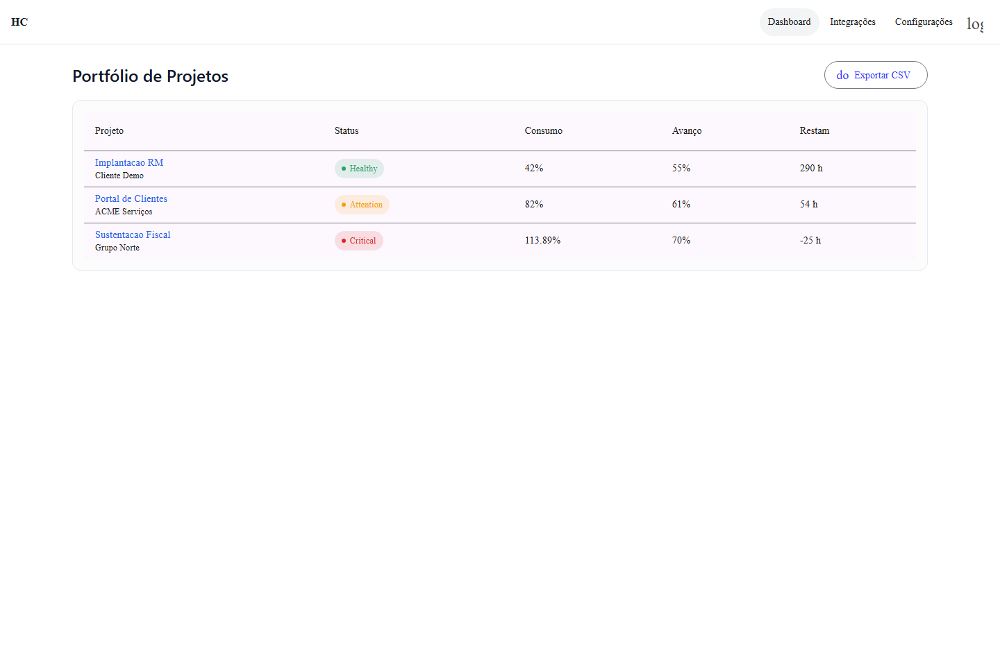
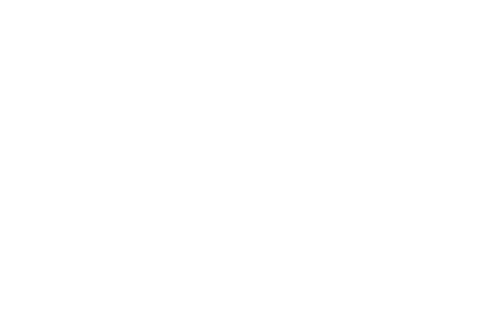
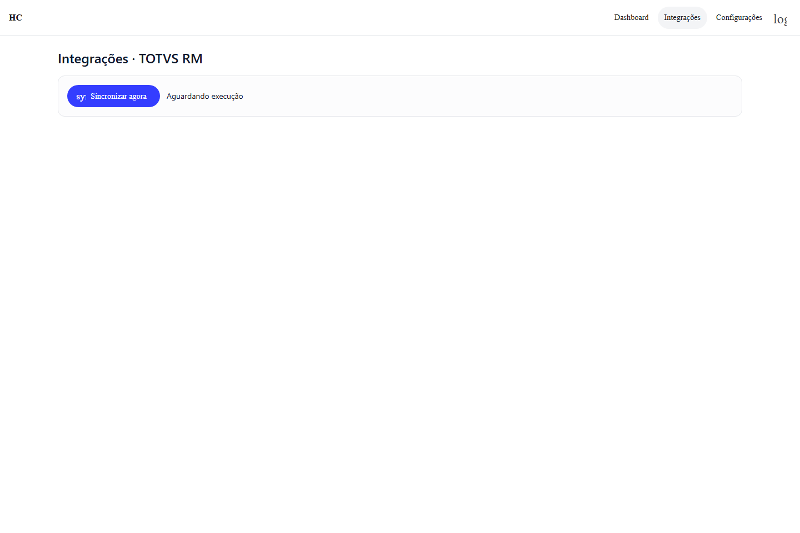

# HC - Health Check de Projetos

Monorepo do case técnico PVT para o módulo **Painel de Projetos**. O objetivo da entrega é demonstrar raciocínio de arquitetura, modelagem de domínio, regras de negócio e uma pequena fatia implementada do fluxo.

O nome **HC** significa **Health Check**.

## Visão Geral

O HC é um painel para acompanhamento da saúde de projetos a partir de clientes, horas vendidas, horas planejadas, apontamentos realizados, avanço físico e prazos.

A decisão central da arquitetura é manter o dashboard independente do ERP em tempo real. Para isso, o BFF possui uma base local e consulta o ERP Mock apenas em sincronizações e health checks externos.

```text
Usuário
  |
  v
Angular 20
  |
  | HTTPS / JSON
  v
BFF ASP.NET Core .NET 10
  |
  +--> PostgreSQL local do painel
  |
  +--> HTTP via Refit
          |
          v
      Spring Boot ERP Mock
          |
          v
      Banco independente do ERP Mock
```

## Screenshots

### Login



### Dashboard de Projetos



### Detalhe do Projeto



### Integrações



## Aplicações

```text
apps/
├── api-springboot/   # ERP Mock externo: Java 21 + Spring Boot
├── bff-dotnet/       # BFF: ASP.NET Core + .NET 10
└── web-angular/      # SPA: Angular 20 + Angular Material + Tailwind
```

## Regras Arquiteturais

- O Angular chama apenas o BFF.
- O dashboard lê dados do banco local do BFF.
- O ERP Mock é acessado pelo BFF somente via HTTP, em sincronizações e health checks.
- O BFF não acessa o banco do ERP Mock.
- O ERP Mock não acessa o banco do BFF.
- A regra oficial de saúde de projeto pertence ao BFF.
- O Angular apenas apresenta os indicadores retornados pela API.
- Thresholds ficam em configuração nesta fase; não há edição dinâmica como requisito inicial.

## Tecnologias

### Angular

O Angular foi escolhido por ser uma habilidade desejada na vaga e também por ser uma ferramenta que gosto de usar. Para este tipo de painel, ele oferece uma base consistente para componentes, rotas, interceptors, formulários, testes e organização por funcionalidades.

### .NET / C#

O BFF usa .NET e C# para centralizar API, autenticação, regra de saúde, tratamento de erros, integração HTTP e acesso ao banco local. A linguagem favorece modelagem tipada e testes unitários claros para regras de negócio.

### Java / Spring Boot

O ERP Mock usa Java e Spring Boot para representar um sistema corporativo externo. A intenção é simular uma integração realista, com contrato próprio e evolução possível para JPA, Flyway, Datafaker e Testcontainers.

## Parte 2 Implementada

A fatia implementada como bônus é a calculadora oficial de saúde de projetos no BFF .NET.

Ela demonstra a decisão mais importante do design: a regra de saúde fica no backend, usa tipos adequados para horas e percentuais, recebe uma data de referência explícita e retorna status e motivos para o Angular apenas apresentar.

Cenários cobertos pelos testes:

- projeto saudável;
- atenção por consumo;
- atenção por desvio de progresso;
- atenção por saldo planejado negativo;
- crítico por saldo contratual negativo;
- crítico por desvio de progresso;
- crítico por atraso;
- inconsistente por horas vendidas zeradas com horas trabalhadas;
- precedência entre status;
- arredondamento de percentuais.

Validação executada em 16/07/2026:

```powershell
cd apps/bff-dotnet
dotnet restore Painel.sln
dotnet build Painel.sln -c Release --no-restore
dotnet test Painel.sln -c Release --no-build
```

Resultado: build com sucesso e **10 testes aprovados**.

## Como Validar a Fase Atual

### Spring Boot

```bash
cd apps/api-springboot
./mvnw test
```

No Windows:

```powershell
cd apps/api-springboot
.\mvnw.cmd test
```

### BFF .NET

```powershell
cd apps/bff-dotnet
dotnet restore Painel.sln
dotnet build Painel.sln -c Release --no-restore
dotnet test Painel.sln -c Release --no-build
```

### Angular

```powershell
cd apps/web-angular
npm ci
npm run lint
npm test
npm run build
npm run e2e
```

## CI

O repositório possui workflows para validar:

- Spring Boot com Maven Wrapper;
- BFF .NET com restore, build e testes;
- Angular com `npm ci`, lint, testes, build e E2E;
- padrão de commits com Conventional Commits.

## Status Atual

O projeto ainda está em refatoração incremental. A fase atual prioriza deixar o monorepo executável, com CI básico confiável, antes de avançar para persistência local completa, sincronização idempotente, seed determinístico e integração final do Angular com os indicadores oficiais do BFF.

## Fluxo de Trabalho

- Issues orientam as tasks por fase.
- Commits seguem Conventional Commits.
- Tags seguem SemVer no formato `vMAJOR.MINOR.PATCH`.
- Secrets reais não devem ser versionados.
