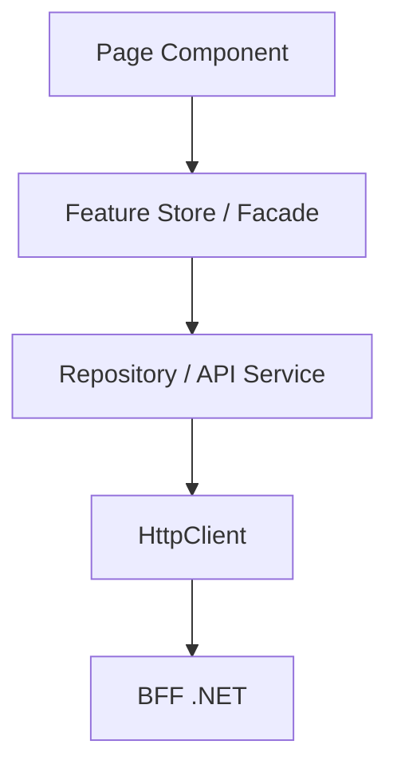

# Arquitetura Angular - HC

Este documento complementa o documento principal da Parte 1 do case. A meta do frontend nao e apenas usar Angular 20, mas demonstrar decisoes arquiteturais intencionais, proporcionais ao tamanho do projeto e defensaveis em entrevista tecnica.

## Diretriz central

O Angular deve ser organizado por funcionalidades, com componentes standalone, rotas lazy e separacao clara entre apresentacao, estado e acesso a dados.

A justificativa tecnica adotada e:

> Signals representam estado sincrono e derivado da interface. RxJS representa fluxos assincronos, eventos, HTTP, cancelamento e composicao temporal. O componente apresenta; a store coordena o estado; o data-access comunica-se com o BFF.

Nao devemos forcar tecnicas em todos os pontos. Toda abstracao deve resolver um problema concreto do case.

## Fluxo recomendado



Regras:

- A UI nunca chama `HttpClient` diretamente.
- A UI nao conhece URL-base, autenticacao HTTP, `ProblemDetails` bruto, contrato do ERP, Refit ou regra oficial de saude.
- A regra oficial de saude permanece no BFF.
- A feature nao importa implementacoes internas de outra feature.

## Estrutura alvo

A estrutura deve ser adaptada incrementalmente ao projeto existente, sem recriar o frontend:

```text
src/app/
├── app.component.ts
├── app.config.ts
├── app.routes.ts
├── core/
│   ├── auth/
│   ├── config/
│   ├── error-handling/
│   ├── http/
│   ├── layout/
│   ├── logging/
│   └── routing/
├── shared/
│   ├── ui/
│   ├── directives/
│   ├── pipes/
│   ├── models/
│   ├── utilities/
│   └── testing/
└── features/
    ├── dashboard/
    ├── projects/
    ├── time-entries/
    ├── integrations/
    ├── settings/
    └── authentication/
```

Regras de organizacao:

- `core` contem recursos singleton e transversais.
- `shared` contem elementos reutilizaveis sem conhecimento das features.
- `features` contem fluxos proprios de apresentacao, estado e acesso a dados.
- `pages` representam unidades roteaveis.
- `components` representam partes da interface.
- `data-access` contem repositories, API clients, mappers e modelos HTTP.
- `state` contem stores, facades e estado da feature.
- Nao criar pastas vazias.
- Nao armazenar tudo em `shared`.
- `index.ts` so deve existir na fronteira publica da feature.

## Exemplo de feature Projects

```text
features/projects/
├── pages/
│   ├── projects-page/
│   └── project-detail-page/
├── components/
│   ├── project-filters/
│   ├── project-table/
│   ├── project-health-card/
│   └── project-summary/
├── data-access/
│   ├── projects-api.service.ts
│   ├── projects.repository.ts
│   ├── http-projects.repository.ts
│   ├── projects-api.mapper.ts
│   └── projects-api.models.ts
├── state/
│   ├── projects.store.ts
│   ├── projects.state.ts
│   └── projects.selectors.ts
├── models/
│   ├── project-list-item.ts
│   ├── project-detail.ts
│   └── project-filters.ts
├── projects.routes.ts
└── index.ts
```

## Componentes

Separar componentes em dois papeis quando houver beneficio real:

| Papel | Responsabilidade |
| --- | --- |
| Page/container | Conectado a rota, coordena estado, dispara acoes e consome store/facade. |
| Presentational | Recebe dados por inputs, emite intencoes por outputs e nao acessa HTTP/store global. |

Padroes esperados:

- `ChangeDetectionStrategy.OnPush`.
- `input()` e `output()` quando compativeis com o projeto.
- `computed()` para dados derivados.
- `@if`, `@for` e `@switch` para controle de fluxo moderno.
- `track` em listas.
- Outputs com nomes de intencao, como `projectSelected`, `filterChanged`, `retryRequested`.

Evitar:

- Componentes com HTTP direto.
- `EventEmitter<any>`.
- Getters pesados no template.
- Subscriptions aninhadas.
- Heranca entre componentes.
- Manipulacao direta do DOM sem necessidade.

## Signals

Signals sao a opcao preferencial para:

- estado local da UI;
- estado da feature;
- filtros;
- selecao;
- paginacao;
- loading;
- error;
- dados ja carregados;
- estado derivado para template.

Uso esperado:

- `signal()` para estado mutavel controlado.
- `computed()` para estado derivado.
- `effect()` apenas para efeitos reais.
- Signals readonly expostos pela store.
- `toSignal()` quando um Observable precisar alimentar o template.

Nao usar `effect()` para propagar estado que `computed()` resolveria. Nao manter `BehaviorSubject` e `signal` para a mesma fonte de verdade.

## RxJS

RxJS deve representar fluxos assincronos e temporais:

- `HttpClient`;
- debounce de filtros;
- cancelamento de pesquisas;
- eventos do Router;
- polling de sincronizacao;
- composicao de multiplas fontes;
- streams de autenticacao;
- retry controlado de acoes da UI quando seguro.

Operadores esperados quando pertinentes:

- `switchMap` para pesquisa e filtros, cancelando a requisicao anterior.
- `exhaustMap` para comandos que nao devem executar em paralelo, como iniciar sincronizacao.
- `concatMap` para comandos que precisam preservar ordem.
- `mergeMap` para tarefas paralelas independentes.
- `forkJoin` para requisicoes finitas que precisam terminar juntas.
- `combineLatest` para combinar fontes continuas.
- `shareReplay` apenas quando houver multiplos consumidores reais.
- `takeUntilDestroyed` para subscriptions ligadas ao ciclo de vida.
- `catchError` para converter erro tecnico em estado compreensivel.

Nao expor `Subject` publicamente. Nao usar retry indiscriminado no frontend; resiliencia da integracao ERP pertence ao BFF.

## Gestao de estado

A estrategia de estado deve ser proporcional:

| Nivel | Uso |
| --- | --- |
| Local | `signal()` dentro do componente para estado que pertence apenas a ele. |
| Feature | Store/facade com Signals e RxJS para dados compartilhados, filtros, paginacao, loading e error. |
| Global | Sessao, usuario, configuracao, tema e notificacoes globais. |

Nao introduzir NgRx global nesta etapa, salvo se a inspecao demonstrar complexidade compartilhada real. Para o case, a opcao inicial e Signal Store propria da feature, facade, repository e funcoes puras.

Modelo conceitual:

```typescript
type LoadStatus = 'idle' | 'loading' | 'success' | 'error';

interface ProjectsState {
  readonly status: LoadStatus;
  readonly items: readonly ProjectListItem[];
  readonly selectedProject: ProjectDetail | null;
  readonly filters: ProjectFilters;
  readonly pagination: PaginationState;
  readonly error: UiError | null;
  readonly lastUpdatedAt: string | null;
}
```

## Data-access e Repository

Separar contrato HTTP da feature:

```text
projects/data-access/
├── projects-api.service.ts
├── projects.repository.ts
├── http-projects.repository.ts
├── projects-api.mapper.ts
└── projects-api.models.ts
```

Responsabilidades:

- `ProjectsApiService` conhece URLs, usa `HttpClient` e representa contrato remoto.
- `ProjectsRepository` oferece operacoes da feature, converte responses e retorna Observables tipados.
- `ProjectsStore` consome repository e mantem estado.
- Page component consome store, nao `HttpClient`.

Nao criar `GenericRepository<T>` nem `BaseApiService` artificial para todo recurso.

## Pipes e operadores customizados

Custom pipes devem ser puros e restritos a transformacao visual, por exemplo:

- `hours`;
- `percentagePoints`;
- `projectHealthLabel`;
- `projectLifecycleLabel`;
- `staleDataAge`;
- `nullableDate`;
- `initials`.

Pipes nao calculam saude, nao fazem requisicoes e nao alteram estado.

Operadores RxJS customizados so devem existir para comportamento recorrente, bem definido e testavel, como `filterDefined`, `mapProblemDetails`, `pollUntilCompleted` ou `withLoadingState`.

## Roteamento

`app.routes.ts` deve conter composicao de alto nivel. Cada feature deve possuir rotas proprias e lazy loading:

```typescript
{
  path: 'projects',
  loadChildren: () =>
    import('./features/projects/projects.routes')
      .then(m => m.PROJECTS_ROUTES),
  canMatch: [authGuard],
  data: {
    title: 'Projetos',
    breadcrumb: 'Projetos'
  }
}
```

Usar guards para experiencia de navegacao, nao como substituto da autorizacao do BFF. Implementar titulo, breadcrumb, pagina 404 e tratamento de erro de navegacao conforme o escopo evoluir.

## Interceptors

Utilizar interceptors funcionais com responsabilidades pequenas:

- `authenticationInterceptor`;
- `correlationIdInterceptor`;
- `apiErrorInterceptor`;
- `requestTimingInterceptor`;
- `loadingInterceptor`, somente se houver loading global real;
- `retryInterceptor`, apenas para operacoes seguras contra o BFF.

Nao aplicar retry automatico em POST de comando nao idempotente.

## Formularios

Usar Reactive Forms tipados para login, filtros avancados, lancamento de horas, rejeicao de apontamento e configuracoes futuras.

Valiacoes no Angular melhoram UX, mas o BFF continua obrigatorio como fonte de validacao de negocio.

## Design system e acessibilidade

Centralizar cores, tipografia, espacamento, radius, status, densidade e animacoes. Angular Material fornece primitives; Tailwind pode apoiar layout e composicao.

A interface deve garantir navegacao por teclado, foco visivel, labels, `aria-live` para carregamento/sincronizacao, contraste, semantica de tabela e estados que nao dependam apenas de cor.

## Performance

Usar lazy routes, OnPush, Signals, `track` em `@for`, paginacao no servidor, debounce em filtros, `switchMap` para cancelamento e budgets no `angular.json`.

Nao carregar todos os projetos para filtrar no navegador. Nao usar `shareReplay` automaticamente em todo endpoint.

## Estados de tela

Cada pagina assincrona deve tratar explicitamente:

- `idle`;
- `loading`;
- `success`;
- `empty`;
- `error`;
- `refreshing`;
- `stale/degraded` quando pertinente.

Durante refresh, dados validos nao devem ser substituidos por tela vazia. O erro deve ser nao destrutivo quando houver snapshot valido.

## Testes Angular

Criar testes para:

- stores;
- repositories;
- mappers;
- pipes;
- guards;
- interceptors;
- componentes criticos;
- formularios;
- operadores RxJS customizados.

Usar `TestScheduler` e marble tests para debounce, polling, retry, cancelamento e concorrencia. O Playwright deve validar autenticacao, dashboard, filtros, paginacao, detalhe, sincronizacao, erro, estado degradado e navegacao.

## Decisoes defensaveis na entrevista

1. Organizacao por feature aumenta coesao, descoberta e lazy loading.
2. Signals resolvem estado sincrono e derivado com granularidade.
3. RxJS resolve HTTP, cancelamento, debounce, polling e composicao temporal.
4. NgRx global nao e adotado inicialmente porque a complexidade atual nao justifica.
5. Pages e componentes presentacionais reduzem acoplamento e melhoram testes.
6. Repository isola HTTP e protege a feature de mudancas de contrato.
7. Lazy routing reduz bundle inicial e cria fronteiras claras.
8. Custom pipes ficam limitados a transformacao de apresentacao.
9. Regra de saude nao fica no Angular para evitar duas fontes de verdade.
10. Abstracoes sao proporcionais ao case e evitam complexidade artificial.

## Criterios de aceite Angular

A arquitetura Angular estara aderente quando:

1. O projeto estiver organizado por feature.
2. Rotas estiverem separadas por feature.
3. Rotas principais forem lazy.
4. Componentes forem standalone.
5. Page components nao fizerem HTTP diretamente.
6. `HttpClient` estiver limitado ao data-access.
7. Stores expuserem estado readonly.
8. Signals representarem estado sincrono e derivado.
9. RxJS representar fluxos assincronos e temporais.
10. Nao houver subscribe aninhado.
11. Subscriptions manuais usarem `takeUntilDestroyed`.
12. A regra oficial de saude nao existir no Angular.
13. Nao houver `any` evitavel.
14. Inputs e outputs forem tipados.
15. Custom pipes forem puros.
16. Custom RxJS operators possuirem testes.
17. Interceptors possuirem responsabilidade unica.
18. Guards nao substituirem autorizacao do backend.
19. Formularios forem tipados.
20. Estados loading, empty, error e stale existirem.
21. Lazy loading estiver configurado.
22. ESLint estiver funcionando.
23. Testes e cobertura passarem.
24. Playwright validar fluxos principais.
25. A arquitetura estiver documentada.
