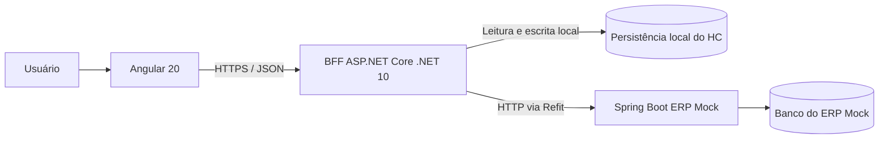
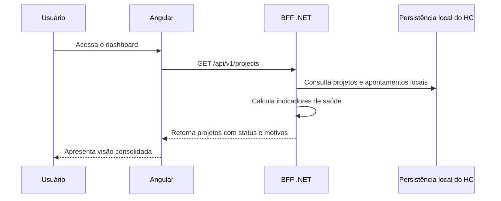
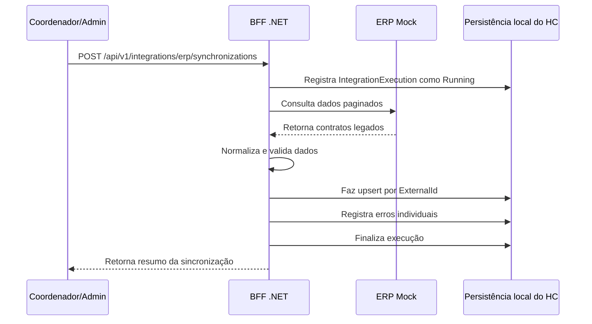
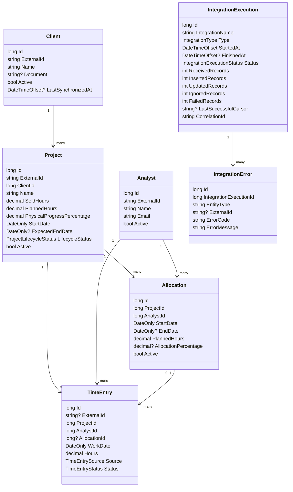
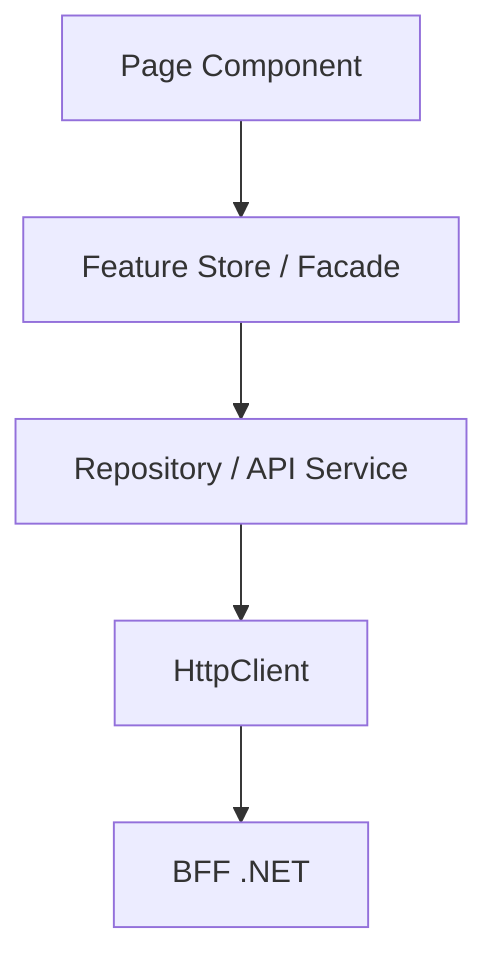

# HC - Documento de Design e Arquitetura

## 1. Resumo executivo

O HC, sigla para Health Check, é um painel para acompanhamento da saúde de projetos. A solução foi pensada para um cenário comum em empresas que prestam serviços: projetos possuem horas vendidas, horas planejadas, apontamentos realizados, avanço físico e datas previstas. A partir desses dados, o painel apresenta uma visão objetiva de risco operacional.

A decisão central da arquitetura é separar o painel do sistema de origem dos dados. O ERP é tratado como um sistema externo, acessado apenas durante sincronizações e verificações de disponibilidade. O BFF mantém uma base local própria, calcula os indicadores oficiais e entrega ao frontend dados prontos para apresentação.

Essa escolha evita que o dashboard dependa do ERP em tempo real. Se o ERP estiver indisponível, o painel continua funcionando com a última carga válida, informando ao usuário que os dados podem estar defasados. Para o escopo do case, essa abordagem demonstra preocupação com resiliência, separação de responsabilidades e evolução incremental, sem tentar transformar o projeto em um ERP completo.

## 2. Objetivo do projeto

O objetivo do HC é permitir que uma equipe de coordenação acompanhe rapidamente quais projetos estão saudáveis, quais exigem atenção e quais estão em situação crítica.

O painel deve responder perguntas como:

- quais projetos estão consumindo horas mais rápido que o avanço físico;
- quais projetos já consumiram mais horas do que o contratado;
- quais projetos estão próximos do prazo final;
- quais projetos estão atrasados;
- quando ocorreu a última sincronização com o ERP;
- se os dados exibidos são atuais ou estão em modo degradado.

A entrega foi dividida em duas partes, conforme o enunciado do case:

- Parte 1: documento de design e arquitetura, cobrindo modelagem, desenho da solução, API e regras de negócio.
- Parte 2: uma fatia implementada, focada na regra oficial de saúde de projetos no BFF.

## 3. Escopo e premissas

Este projeto não tenta implementar um ERP completo. O ERP Mock existe para simular uma integração externa e permitir que a arquitetura lide com dados legados, falhas de comunicação e sincronização.

Premissas adotadas:

- o Angular é responsável pela experiência do usuário, não por regras críticas de negócio;
- o BFF é a fonte de verdade para regras do painel;
- o ERP Mock representa o sistema externo de origem;
- o BFF possui banco local para leitura rápida e independente;
- a integração com o ERP ocorre por HTTP;
- a regra de saúde deve ser testável, determinística e auditável;
- horas e percentuais devem usar tipos decimais, não ponto flutuante binário;
- thresholds de saúde começam como configuração, não como edição dinâmica em tela.

A edição dinâmica de thresholds não foi considerada requisito essencial para a primeira versão. Ela pode ser adicionada depois, mas manter os thresholds por configuração reduz o escopo inicial e evita criar uma tela administrativa antes de haver necessidade real.

## 4. Arquitetura proposta



A arquitetura possui três aplicações principais:

| Aplicação | Responsabilidade |
| --- | --- |
| Angular 20 | Interface do painel, navegação, filtros, estados visuais e apresentação dos indicadores. |
| BFF ASP.NET Core | API do painel, autenticação, regra de saúde, persistência local, sincronização e tratamento de erros. |
| Spring Boot ERP Mock | Simulação de ERP externo com contratos legados, dados em memória e fronteira isolada do BFF. |

A separação entre BFF e ERP Mock é intencional. O BFF não acessa o banco do ERP, e o ERP não acessa o banco do BFF. A única comunicação entre eles é HTTP. Isso preserva uma fronteira parecida com a que existiria em um ambiente real.


#

## 4.1 Estado executável da entrega

Além do desenho-alvo, a entrega atual foi ajustada para rodar localmente sem depender de serviços externos não documentados. As portas padrão são:

| Componente | Porta local | Observação |
| --- | --- | --- |
| ERP Mock Spring Boot | `18082` | API externa simulada consumida pelo BFF via HTTP. |
| BFF ASP.NET Core | `5080` | API pública do painel e Swagger em `/swagger`. |
| Angular | `4200` | SPA que consome somente o BFF. |

A porta do ERP Mock foi definida como `18082` para reduzir conflito com serviços comuns em `8080`, `8081` e `8082`. O BFF aponta para `Erp:BaseUrl=http://localhost:18082` no `appsettings.json` e no fallback de bootstrap.

Para avaliação local, o BFF não exige PostgreSQL. Quando `ConnectionStrings: Painel` está vazia, o EF Core usa banco em memória. Isso preserva a arquitetura de persistência local e remove uma barreira operacional para execução do case. Em ambiente real, a connection string deve apontar para PostgreSQL e as migrations devem ser aplicadas.

Também existe um `Jwt:Secret` local de teste no `appsettings.json`. Ele não é um secret real; serve apenas para impedir falha de bootstrap em `dotnet run` durante a avaliação. Em ambiente real, esse valor deve ser sobrescrito por `Jwt__Secret` via variável de ambiente ou secret manager.

## 5. Decisões arquiteturais

| Decisão | Justificativa |
| --- | --- |
| Angular chama apenas o BFF | Evita acoplamento do frontend com o ERP e centraliza segurança, regras e contratos públicos. |
| BFF possui persistência local própria | O alvo é PostgreSQL para manter o dashboard disponível mesmo quando o ERP estiver indisponível; na execução local do case, EF InMemory é usado quando a connection string está vazia. |
| ERP Mock é isolado do BFF | Simula uma fronteira real entre sistemas e evita compartilhamento indevido de dados. A entrega atual usa dados em memória com seed determinístico; a evolução pode adicionar banco próprio. |
| Refit fica na Infrastructure do BFF | Mantém a integração HTTP isolada da camada de domínio e aplicação. |
| Saúde do projeto é calculada no BFF | Evita duas fontes de verdade e permite testes unitários sobre a regra oficial. |
| Angular apenas apresenta indicadores | Reduz duplicação de regra e simplifica a evolução do frontend. |
| IDs internos usam `long` e `ExternalId` fica separado | Separa identidade local da identidade do ERP externo. |
| Horas usam `decimal` e `BigDecimal` | Evita erros de arredondamento em dados financeiros e gerenciais. |
| Thresholds começam por configuração | Mantém o escopo proporcional ao case e deixa a edição dinâmica como evolução futura. |
| Versionamento por SemVer e commits convencionais | Deixa a evolução do projeto rastreável e facilita explicar o progresso por etapas. |

## 6. Fluxos principais

#

## 6.1 Consulta do dashboard



O dashboard não consulta o ERP diretamente. Essa é uma decisão importante porque telas de acompanhamento precisam estar disponíveis mesmo quando integrações externas falham.

#

## 6.2 Sincronização com o ERP



A sincronização deve ser idempotente. Executar o mesmo processo mais de uma vez não deve duplicar clientes, projetos, analistas ou apontamentos. A chave para isso é manter `ExternalId` separado do ID interno.

## 7. Modelagem de domínio

A modelagem foi construída em torno de projetos, clientes, analistas, alocações, apontamentos e execuções de integração.



#

## 7.1 Entidades principais

| Entidade | Papel no domínio |
| --- | --- |
| `Client` | Representa o cliente dono de um ou mais projetos. |
| `Project` | Entidade central do painel; concentra contrato de horas, planejamento, avanço e status de ciclo de vida. |
| `Analyst` | Profissional que pode estar alocado em projetos e registrar horas. |
| `Allocation` | Planejamento de participação de um analista em um projeto. |
| `TimeEntry` | Registro de horas trabalhadas. Apenas apontamentos aprovados entram nos indicadores. |
| `IntegrationExecution` | Registro auditável de uma execução de integração com o ERP. |
| `IntegrationError` | Erro individual de importação, sem abortar toda a carga. |

#

## 7.2 Enums relevantes

- `ProjectLifecycleStatus`: `Planned`, `InProgress`, `Completed`, `Cancelled`.
- `ProjectHealthStatus`: `Healthy`, `Attention`, `Critical`, `Inconsistent`.
- `TimeEntrySource`: `Portal`, `Erp`, `Import`.
- `TimeEntryStatus`: `Pending`, `Approved`, `Rejected`, `Cancelled`.
- `IntegrationType`: `Full`, `Incremental`, `Manual`.
- `IntegrationExecutionStatus`: `Running`, `Succeeded`, `PartiallySucceeded`, `Failed`, `Cancelled`.

## 8. Regra de saúde de projetos

A regra de saúde é o ponto mais importante do domínio. Por isso, ela fica no BFF e não no Angular.

#

## 8.1 Entradas

A regra considera:

- horas vendidas;
- horas planejadas;
- horas apontadas e aprovadas;
- avanço físico;
- data prevista de término;
- status de ciclo de vida;
- thresholds configurados;
- data de referência.

A data de referência é recebida como parâmetro. A regra não chama `DateTime.UtcNow` internamente, porque isso dificultaria testes determinísticos e poderia gerar resultados diferentes dependendo do momento da execução.

#

## 8.2 Fórmulas

```text
WorkedHours = soma de TimeEntry.Hours onde Status == Approved
ContractBalanceHours = SoldHours - WorkedHours
PlannedBalanceHours = PlannedHours - WorkedHours
ConsumptionPercentage = WorkedHours / SoldHours * 100
ProgressGapPercentagePoints = ConsumptionPercentage - PhysicalProgressPercentage
```

Quando `SoldHours` é zero, o percentual de consumo não deve ser calculado. Se houver horas trabalhadas com horas vendidas iguais a zero, o projeto é classificado como inconsistente.

#

## 8.3 Projeto atrasado

Um projeto é considerado atrasado quando:

- a data prevista de término é menor que a data de referência;
- o ciclo de vida não é `Completed`;
- o avanço físico é menor que 100%.

#

## 8.4 Status e prioridade

A prioridade evita ambiguidade quando um projeto se encaixa em mais de uma condição.

1. `Inconsistent`
2. `Critical`
3. `Attention`
4. `Healthy`

| Status | Condições |
| --- | --- |
| `Inconsistent` | Dados essenciais impossíveis de calcular, como horas vendidas zeradas com horas trabalhadas. |
| `Critical` | Saldo contratual negativo, desvio crítico de progresso ou projeto atrasado. |
| `Attention` | Consumo alto, desvio moderado, saldo planejado negativo ou prazo próximo. |
| `Healthy` | Nenhuma condição de inconsistência, criticidade ou atenção. |

Thresholds iniciais:

```json
{
  "ProjectHealth": {
    "AttentionConsumptionPercentage": 80,
    "AttentionProgressGap": 10,
    "CriticalProgressGap": 25,
    "ExpectedEndDateWarningDays": 15
  }
}
```

## 9. API do BFF

A API pública do painel usa base path `/api/v1`, JSON em camelCase, datas em ISO 8601 e respostas de erro padronizadas com `ProblemDetails`.

#

## 9.1 Projetos

| Método | Rota | Uso |
| --- | --- | --- |
| `GET` | `/projects` | Lista paginada de projetos para dashboard. |
| `GET` | `/projects/{id}` | Detalhe de um projeto. |
| `GET` | `/projects/{id}/health` | Indicadores e motivos da saúde do projeto. |
| `GET` | `/projects/{id}/allocations` | Alocações do projeto. |
| `GET` | `/projects/{id}/time-entries` | Apontamentos do projeto. |

Filtros previstos para `/projects`:

- `search`
- `clientId`
- `healthStatus`
- `lifecycleStatus`
- `hasNegativeBalance`
- `isDelayed`
- `page`
- `pageSize`
- `sortBy`
- `sortDirection`

#

## 9.2 Apontamentos

| Método | Rota | Uso |
| --- | --- | --- |
| `POST` | `/time-entries` | Cria apontamento manual. |
| `GET` | `/time-entries/{id}` | Consulta apontamento. |
| `POST` | `/time-entries/{id}/approval` | Aprova apontamento. |
| `POST` | `/time-entries/{id}/rejection` | Rejeita apontamento. |
| `DELETE` | `/time-entries/{id}` | Cancela apontamento. |

#

## 9.3 Integração ERP

| Método | Rota | Uso |
| --- | --- | --- |
| `POST` | `/integrations/erp/synchronizations` | Inicia sincronização manual. |
| `GET` | `/integrations/erp/synchronizations/latest` | Consulta última sincronização. |
| `GET` | `/integrations/erp/synchronizations/{id}` | Consulta detalhe da execução. |
| `GET` | `/integrations/erp/health` | Verifica disponibilidade externa do ERP. |

## 10. Contrato com o ERP Mock

O ERP Mock simula um sistema legado. Por isso, seus contratos externos podem retornar nomes e formatos que não seriam ideais em uma API nova.

Exemplo de payload legado:

```json
{
  "CODPROJETO": "PRJ-DEMO-0001",
  "NOMEPROJETO": " Implantação RM ",
  "CODCLIENTE": "CLI-DEMO-0001",
  "HORASVENDIDAS": "500,00",
  "HORASPLANEJADAS": "450,00",
  "AVANCOFISICO": "55",
  "DTINICIO": "15/01/2026",
  "DTFIMPREV": "30/08/2026",
  "SITUACAO": "E",
  "DTALTERACAO": "13/07/2026 14:30:00"
}
```

O BFF não reutiliza esse DTO como modelo interno. A conversão passa por uma camada anticorrupção:

1. DTO externo do ERP.
2. Modelo de importação validado.
3. Entidade do domínio local.
4. DTO público do BFF.

Essa separação permite mudar o contrato do ERP ou da API pública sem contaminar o domínio.

## 11. Persistência local

O BFF deve possuir persistência local própria. O alvo arquitetural é PostgreSQL, mas a entrega executável usa EF InMemory quando `ConnectionStrings: Painel` está vazia, permitindo rodar o case sem banco externo. As tabelas previstas para a evolução relacional são:

- `clients`
- `projects`
- `analysts`
- `allocations`
- `time_entries`
- `integration_executions`
- `integration_errors`
- `audit_events`, caso a auditoria seja mantida

Padrões de persistência:

- nomes em `snake_case`;
- IDs locais como `bigint identity`;
- horas e percentuais como `numeric`;
- instantes como `timestamptz`;
- enums persistidos como string;
- relacionamentos com `DeleteBehavior.Restrict`;
- índices para `external_id`, relacionamentos e consultas do dashboard.

A leitura do dashboard deve usar projeções, paginação e `AsNoTracking`, evitando `Include` excessivo e consultas N+1.

## 12. Arquitetura do frontend Angular

O frontend deve demonstrar arquitetura proporcional ao case. A proposta é organizar o Angular por funcionalidades, usando componentes standalone, rotas lazy e separação entre apresentação, estado e acesso a dados.



Diretrizes principais:

- pages coordenam fluxo de tela;
- componentes presentacionais recebem inputs e emitem outputs tipados;
- stores de feature mantêm estado de carregamento, erro, filtros, paginação e dados;
- Signals representam estado síncrono e derivado;
- RxJS representa HTTP, debounce, cancelamento, polling e composição temporal;
- repositories isolam o `HttpClient` e o contrato do BFF;
- pipes customizados ficam restritos a transformação visual;
- a regra oficial de saúde não é recalculada no Angular.

A estrutura completa proposta está no documento complementar `docs/architecture/angular-architecture.md`.

A justificativa para a entrevista é simples: Signals são bons para estado local e derivado da interface; RxJS continua sendo a ferramenta adequada para fluxos assíncronos, HTTP, cancelamento e polling. Não há necessidade de introduzir NgRx global nesta etapa, porque o escopo atual pode ser resolvido com stores por feature.

## 13. Tratamento de erros e segurança

O BFF deve usar `ProblemDetails` para padronizar erros. O objetivo é retornar mensagens compreensíveis sem expor detalhes internos.

Mapeamento previsto:

| Exceção | Status HTTP |
| --- | --- |
| `ValidationException` | 400 |
| `NotFoundException` | 404 |
| `ConflictException` | 409 |
| `BusinessRuleException` | 422 |
| `ExternalServiceException` | 503 |
| Erro não tratado | 500 |

A API não deve expor stack trace, SQL, connection string, secrets ou payload sensível.

A autenticação mock é aceitável apenas em ambiente de desenvolvimento ou avaliação técnica. O `Jwt:Secret` local versionado é deliberadamente um segredo de teste para evitar falha de bootstrap em `dotnet run`; ele não deve ser tratado como segredo real. Em produção, o BFF deve sobrescrever esse valor por variável de ambiente ou secret manager. Secrets reais não devem ser versionados.

## 14. Estratégia de testes

Os testes foram pensados para acompanhar o risco de cada camada.

| Camada | Testes previstos |
| --- | --- |
| Domínio BFF | Regra de saúde, precedência, arredondamento, divisão por zero e motivos. |
| Application BFF | Casos de uso, paginação, mapeamentos e integrações por portas. |
| Infrastructure BFF | EF Core InMemory local, PostgreSQL/migrations como evolução relacional, Refit, health checks e persistência. |
| ERP Mock | Seed determinístico, paginação, filtros e contratos legados. |
| Angular | Stores, services, mappers, pipes, guards, interceptors e estados de tela. |
| E2E | Login, dashboard, detalhe, sincronização e cenário degradado. |

A cobertura deve crescer de forma progressiva. Para o case, é melhor apresentar testes reais e relevantes do que inflar cobertura com testes frágeis.

## 15. Parte 2 implementada

A fatia implementada para o bônus foi a regra oficial de saúde de projetos no BFF.

Arquivos principais:

- `apps/bff-dotnet/src/Painel.Domain/Indicators.cs`
- `apps/bff-dotnet/src/Painel.Domain/Models.cs`
- `apps/bff-dotnet/tests/Painel.Tests/IndicatorsTests.cs`

O que foi implementado:

- `ProjectHealthCalculator` no domínio;
- `ProjectHealthResult` com saldos, consumo, desvio, atraso, status e motivos;
- uso de `decimal` para horas e percentuais;
- data de referência explícita;
- status `Healthy`, `Attention`, `Critical` e `Inconsistent`;
- precedência clara entre os status;
- testes unitários para os principais cenários.

Comandos validados em 16/07/2026:

```powershell
cd apps/bff-dotnet
dotnet restore Painel.sln
dotnet build Painel.sln -c Release --no-restore
dotnet test Painel.sln -c Release --no-build
```

Resultado validado:

- build com êxito;
- 0 avisos;
- 0 erros;
- 10 testes aprovados.

Essa fatia foi escolhida porque demonstra a decisão mais importante do desenho: a regra crítica do negócio fica no backend, é determinística, testável e não depende do Angular.

## 16. Plano de evolução

A evolução proposta é incremental:

1. Consolidar o repositório executável, wrappers, lockfiles e CI básico.
2. Evoluir o domínio do BFF com entidades reais, invariantes e testes.
3. Finalizar a regra de saúde e remover duplicação do Angular.
4. Evoluir a persistência local do BFF de EF InMemory para PostgreSQL com migrations.
5. Evoluir o ERP Mock com JPA, Flyway, Datafaker e seed determinístico.
6. Implementar sincronização idempotente via Refit.
7. Expor endpoints completos do BFF com paginação, filtros e `ProblemDetails`.
8. Refatorar o Angular por features, stores, repositories e estados de tela.
9. Completar Docker Compose, E2E integrado e documentação operacional.

## 17. Riscos e mitigação

| Risco | Mitigação |
| --- | --- |
| ERP indisponível afetar o dashboard | BFF mantém banco local e última carga válida. |
| Regra duplicada entre frontend e backend | Regra oficial fica no BFF; Angular apenas apresenta o resultado. |
| Contrato legado contaminar o domínio | Camada anticorrupção separa DTO externo, import model, domínio e response pública. |
| Sincronização duplicar dados | Upsert por `ExternalId` e execução idempotente. |
| Complexidade excessiva para o case | Evolução por fases e abstrações apenas quando resolvem problema concreto. |
| Dados numéricos imprecisos | Uso de `decimal`/`BigDecimal` para horas e percentuais. |
| Testes frágeis por uso de relógio real | Regras recebem data de referência explicitamente. |

## 18. Como defender a solução na entrevista

A defesa principal é que a arquitetura foi desenhada para equilibrar simplicidade e realismo.

O ponto mais importante é a separação entre leitura operacional e integração externa. O dashboard não deve depender do ERP em tempo real, porque isso deixaria a experiência do usuário vulnerável a falhas de outro sistema. Por isso, o BFF mantém uma base local e sincroniza dados em momentos controlados.

A segunda decisão importante é manter a regra de saúde no BFF. Se o Angular calculasse saúde por conta própria, qualquer outro consumidor da API poderia apresentar resultados diferentes. Centralizar a regra no backend melhora consistência, teste e auditoria.

A terceira decisão é tratar o ERP como legado por meio de uma camada anticorrupção. O payload externo pode ter nomes, formatos e regras próprias; isso não deve vazar para o domínio do painel.

Por fim, a solução não tenta usar padrões sofisticados sem necessidade. Não há microserviços, mensageria, CQRS distribuído ou NgRx global porque o problema ainda não exige esse custo. A arquitetura deixa espaço para evolução, mas começa pelo que resolve o case de forma clara.

## 19. Conclusão

O HC foi desenhado como um painel resiliente para acompanhamento de projetos. A solução preserva uma fronteira clara entre frontend, BFF e ERP Mock, centraliza a regra de saúde no backend e propõe uma evolução incremental com testes e versionamento.

A Parte 1 apresenta o desenho completo da solução. A Parte 2 implementa a regra de maior valor para o domínio, com testes automatizados, demonstrando que a arquitetura proposta não ficou apenas no papel.
